# GoPlay Sports Platform - Entity Relationship Diagram

## Database ER Diagram

```mermaid
erDiagram
    %% User Management
    users {
        int id PK
        varchar username UK
        varchar email UK
        varchar password_hash
        varchar first_name
        varchar last_name
        varchar phone
        date date_of_birth
        varchar profile_picture
        enum user_type
        enum status
        timestamp created_at
        timestamp updated_at
    }

    user_addresses {
        int id PK
        int user_id FK
        enum address_type
        varchar street_address
        varchar city
        varchar state
        varchar postal_code
        varchar country
        boolean is_default
        timestamp created_at
    }

    %% Sports Categories
    sports_categories {
        int id PK
        varchar name UK
        text description
        varchar icon
        varchar image
        boolean is_active
        timestamp created_at
    }

    %% Coaches
    coaches {
        int id PK
        int user_id FK
        int sport_category_id FK
        int experience_years
        decimal hourly_rate
        text bio
        text specializations
        text certifications
        decimal rating
        int total_reviews
        int total_sessions
        json availability_schedule
        varchar location
        enum status
        timestamp created_at
        timestamp updated_at
    }

    coach_reviews {
        int id PK
        int coach_id FK
        int user_id FK
        int booking_id FK
        int rating
        text review_text
        timestamp created_at
    }

    coach_bookings {
        int id PK
        int user_id FK
        int coach_id FK
        date booking_date
        time start_time
        time end_time
        decimal duration_hours
        enum session_type
        decimal total_amount
        text special_requests
        enum status
        enum payment_status
        timestamp created_at
        timestamp updated_at
    }

    %% Sports Facilities
    sports_facilities {
        int id PK
        int owner_id FK
        varchar name
        text description
        int sport_category_id FK
        text address
        varchar city
        varchar state
        varchar postal_code
        varchar country
        decimal latitude
        decimal longitude
        decimal hourly_rate
        int capacity
        json amenities
        json images
        text rules
        decimal rating
        int total_reviews
        enum status
        timestamp created_at
        timestamp updated_at
    }

    facility_reviews {
        int id PK
        int facility_id FK
        int user_id FK
        int booking_id FK
        int rating
        text review_text
        timestamp created_at
    }

    facility_bookings {
        int id PK
        int user_id FK
        int facility_id FK
        date booking_date
        time start_time
        time end_time
        decimal duration_hours
        decimal total_amount
        text special_requests
        enum status
        enum payment_status
        timestamp created_at
        timestamp updated_at
    }

    %% Products & E-commerce
    product_categories {
        int id PK
        varchar name UK
        int parent_id FK
        text description
        varchar image
        boolean is_active
        timestamp created_at
    }

    products {
        int id PK
        varchar name
        varchar sku UK
        text description
        int category_id FK
        varchar brand
        decimal price
        decimal compare_price
        decimal cost_price
        int stock_quantity
        int min_stock_level
        decimal weight
        varchar dimensions
        json specifications
        json features
        json images
        json tags
        enum status
        decimal rating
        int total_reviews
        int total_sales
        timestamp created_at
        timestamp updated_at
    }

    product_reviews {
        int id PK
        int product_id FK
        int user_id FK
        int order_id FK
        int rating
        varchar title
        text review_text
        json images
        boolean is_verified_purchase
        timestamp created_at
    }

    shopping_cart {
        int id PK
        int user_id FK
        int product_id FK
        int quantity
        decimal price
        timestamp created_at
        timestamp updated_at
    }

    %% Orders & Payments
    orders {
        int id PK
        varchar order_number UK
        int user_id FK
        enum order_type
        decimal subtotal
        decimal tax_amount
        decimal shipping_amount
        decimal discount_amount
        decimal total_amount
        varchar currency
        enum status
        enum payment_status
        enum payment_method
        json shipping_address
        json billing_address
        text notes
        timestamp created_at
        timestamp updated_at
    }

    order_items {
        int id PK
        int order_id FK
        int product_id FK
        int coach_booking_id FK
        int facility_booking_id FK
        varchar item_name
        text item_description
        int quantity
        decimal unit_price
        decimal total_price
        timestamp created_at
    }

    payments {
        int id PK
        int order_id FK
        varchar transaction_id UK
        enum payment_method
        decimal amount
        varchar currency
        enum status
        json gateway_response
        timestamp processed_at
        timestamp created_at
    }

    %% Notifications
    notifications {
        int id PK
        int user_id FK
        enum type
        varchar title
        text message
        json data
        boolean is_read
        timestamp created_at
    }

    %% Settings
    settings {
        int id PK
        varchar key_name UK
        text value
        text description
        enum type
        timestamp created_at
        timestamp updated_at
    }

    %% Relationships
    users ||--o{ user_addresses : has
    users ||--o{ coaches : becomes
    users ||--o{ sports_facilities : owns
    users ||--o{ coach_bookings : makes
    users ||--o{ facility_bookings : makes
    users ||--o{ coach_reviews : writes
    users ||--o{ facility_reviews : writes
    users ||--o{ product_reviews : writes
    users ||--o{ shopping_cart : has
    users ||--o{ orders : places
    users ||--o{ notifications : receives

    sports_categories ||--o{ coaches : specializes_in
    sports_categories ||--o{ sports_facilities : supports

    coaches ||--o{ coach_bookings : receives
    coaches ||--o{ coach_reviews : gets_reviewed
    coach_bookings ||--o{ coach_reviews : generates

    sports_facilities ||--o{ facility_bookings : receives
    sports_facilities ||--o{ facility_reviews : gets_reviewed
    facility_bookings ||--o{ facility_reviews : generates

    product_categories ||--o{ product_categories : has_subcategory
    product_categories ||--o{ products : contains
    products ||--o{ product_reviews : gets_reviewed
    products ||--o{ shopping_cart : added_to
    products ||--o{ order_items : included_in

    orders ||--o{ order_items : contains
    orders ||--o{ payments : processed_by
    orders ||--o{ product_reviews : enables

    coach_bookings ||--o{ order_items : can_be_ordered
    facility_bookings ||--o{ order_items : can_be_ordered
```

## Key Relationships Explained

### 1. **User-Centric Design**
- `users` is the central entity connecting to all major modules
- Supports multiple user types: customers, admins, coaches, facility owners
- Each user can have multiple addresses for different purposes

### 2. **Sports Categories Hub**
- `sports_categories` serves as a lookup table for all sports
- Connected to both coaches and facilities for specialization
- Enables easy filtering and categorization

### 3. **Coach Management System**
- `coaches` extends user profiles with sport-specific information
- `coach_bookings` handles session scheduling and payments
- `coach_reviews` provides feedback and rating system
- Full booking lifecycle: pending → confirmed → completed

### 4. **Facility Management System**
- `sports_facilities` managed by facility owners (users)
- `facility_bookings` handles court/ground reservations
- `facility_reviews` enables user feedback
- Location-based with latitude/longitude for mapping

### 5. **E-commerce Integration**
- `products` with rich JSON fields for specifications and features
- `shopping_cart` for temporary storage before purchase
- `orders` and `order_items` for complete transaction tracking
- `product_reviews` with verified purchase validation

### 6. **Unified Booking & Payment System**
- `orders` can contain products, coach bookings, or facility bookings
- `payments` tracks all financial transactions
- `order_items` provides flexibility for mixed cart contents
- Multiple payment methods and status tracking

### 7. **Review & Rating System**
- Separate review tables for coaches, facilities, and products
- All reviews link back to actual bookings/purchases for authenticity
- Rating aggregation updates parent entity ratings

### 8. **Notification System**
- `notifications` handles all user communications
- Typed notifications for different events
- Supports JSON data for rich notification content

## Database Design Principles Used

✅ **Normalization**: Proper 3NF structure with minimal redundancy  
✅ **Referential Integrity**: Foreign keys maintain data consistency  
✅ **Scalability**: JSON fields for flexible data storage  
✅ **Indexing**: Strategic indexes on frequently queried columns  
✅ **Security**: Prepared statements and proper data types  
✅ **Flexibility**: ENUM types allow for controlled expansion  
✅ **Audit Trail**: Created/updated timestamps on all major tables  

## Total Tables: 15
- **User Management**: 2 tables
- **Sports & Categories**: 1 table  
- **Coach System**: 3 tables
- **Facility System**: 3 tables
- **E-commerce System**: 4 tables
- **Payment System**: 1 table
- **Communication**: 1 table
- **Configuration**: 1 table

This database design supports the complete GoPlay Sports Platform ecosystem with room for future expansion and modifications.